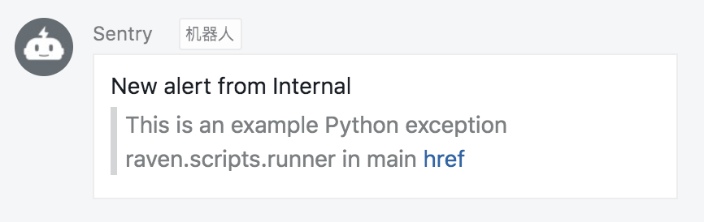

# Sentry-DingDing

`Sentry`的`钉钉`通知插件.

## 安装

如果是以Python的方式运行，使用`pip`安装即可

```bash
$ pip install sentry-dingding
```

如果是以docker的方式运行，进入容器然后在`pip`安装

```bash

```

## 使用

在所有集成页面找到`DingDing`插件，启用，并设置`Access Token`


在插件上使用`Test Plugin`进行测试，当配置好`Access Token`后，在钉钉群内会得到以下警告




点击`href`按钮，打开异常详情页面。